# prog8860-assignment1-9020861-varun
Initial commit
# Assignment 1 – End-to-End CI/CD with GitHub Actions & DockerHub

**Student:** Varun Kakkar (ID: 9020861)  
**Personal Repo:** https://github.com/kakkarvarun/prog8860-assignment1-9020861-varun  
**Docker Image:** https://hub.docker.com/r/vkakkar09/ci-cd-assignment1-9020861

## Overview
This project implements a complete CI/CD pipeline for a Python (Flask) app:
- **Build** → compile bytecode (artifact uploaded)
- **Test** → `pytest` unit tests (workflow fails on test failure)
- **Containerize** → Docker image from `Dockerfile`
- **Publish** → push to Docker Hub with meaningful tags
- **Environment Awareness** → `dev` on `develop`, `production` on `release`, variables pulled from GitHub Environments
- **Bonus** → Trivy security scan (filesystem)

## Branching Strategy
Branches used:
- `assignment1-9020861-varun` (working branch)
- `develop` (triggers **dev** environment)
- `release` (triggers **production** environment)
- `varun-9020861` (main for the PR target)

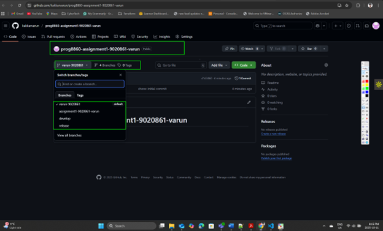
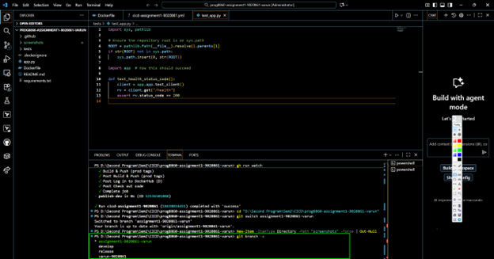

## CI/CD Workflow
Workflow file: `.github/workflows/cicd-assignment1-9020861.yml`  
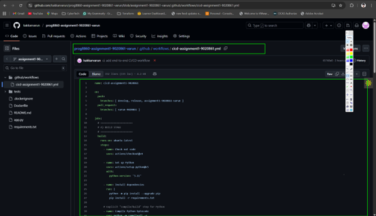

### A) Build
- Setup Python 3.11, install deps, compile bytecode, upload artifact.

### B) Test
- Run `pytest -q`. If tests fail, job and workflow fail.
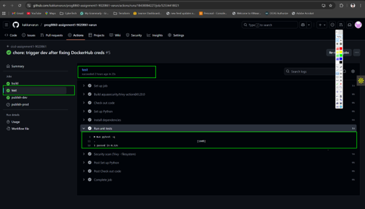
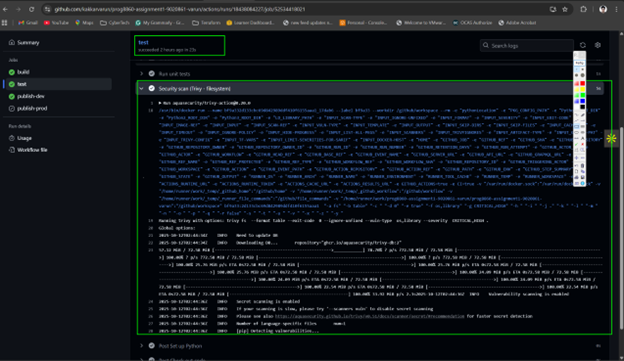

### C) Containerization
- Build Docker image using `Dockerfile`.
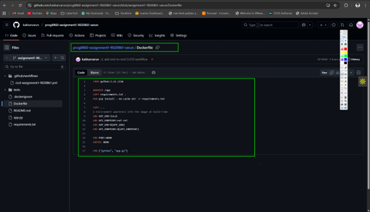

### D) Publish
- Login to Docker Hub using repo **secrets** (`DOCKERHUB_USERNAME`, `DOCKERHUB_TOKEN`) and push:
  - On `develop`: tags `<sha>`, `dev-<run>`, `latest-dev`
  - On `release`: tags `<sha>`, `prod-<run>`, `latest`

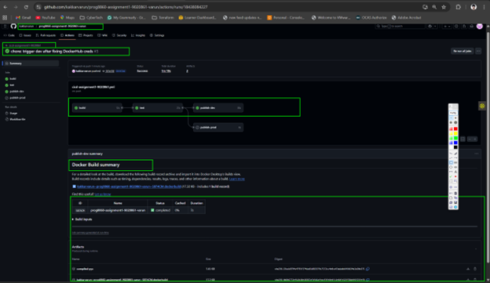
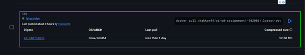
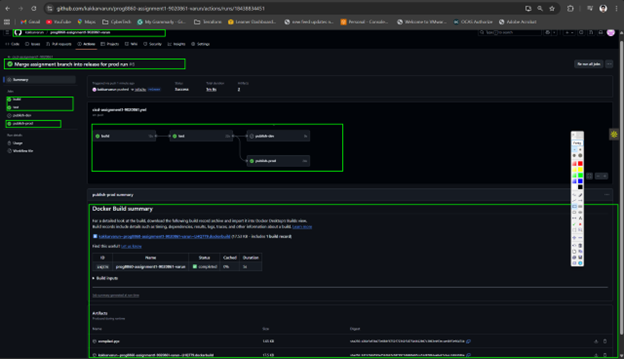
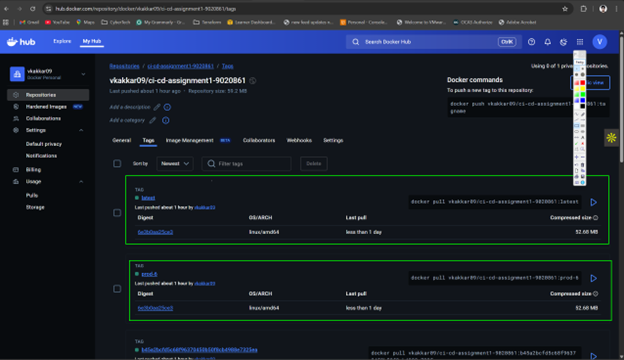

### E) Environment Awareness
- GitHub **Environments**: `dev` (for `develop`) and `production` (for `release`)
- Variables: `APP_ENV`, `API_ENDPOINT` are injected as Docker build-args

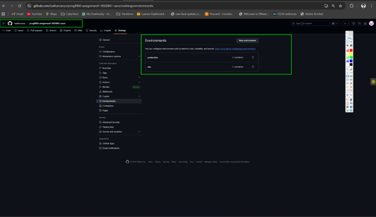
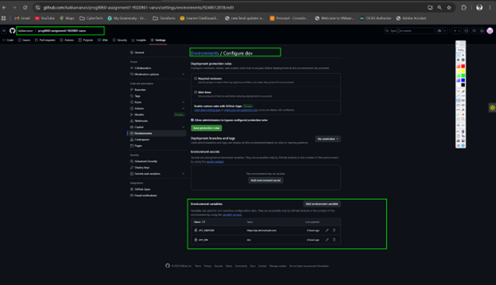
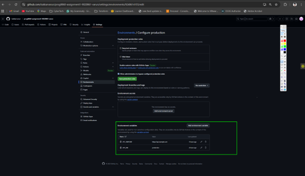

### Secrets and Variables (GitHub)


## Run the Container Locally
```bash
docker pull vkakkar09/ci-cd-assignment1-9020861:latest-dev
docker run -p 8080:8080 -e APP_ENV=local -e API_ENDPOINT=https://localhost/demo \
  vkakkar09/ci-cd-assignment1-9020861:latest-dev
# Open http://localhost:8080 and http://localhost:8080/health

Pull Request & Review (Professor Repo)

PR base: prog8860-f25-cicd/prog8860-f25-cicd → branch varun-9020861

PR head: kakkarvarun:varun-9020861-assignment1

Reviewer(s): dearjay22, Instructor: aagamjhaveri